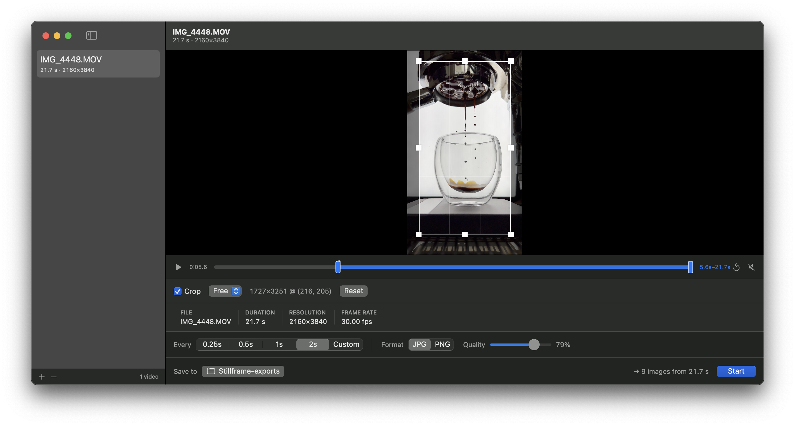

# Stillframe



**Video in, frames out.**

A small macOS app that turns videos into a set of still images. Drop a video in, say "one image
every half second," and get a folder of numbered JPGs or PNGs — no video editor, no command line.

> **Status:** v1 feature-complete. Every item in the list below works end to end.
> See [`planning.md`](planning.md) for how it was built and what's verified.

---

## What it does

- **Drag and drop** `.mp4`, `.mov`, `.m4v` — one video or several
- **Preview** each clip with playback before exporting
- **Crop** to a target region by dragging a rectangle on the preview, with optional aspect lock
- **Trim** to an in/out range so you only sample the part you care about
- **Interval** presets (0.25 / 0.5 / 1 / 2 s) or a custom value, with a live image-count estimate
- **JPG** with adjustable quality, or **PNG**
- **Batch** export with per-video progress, cancel, and Reveal in Finder

Crop and trim are set per video; the interval, format, and output folder apply to the whole queue.

---

## How many images do I get?

Sampling is **half-open** — the closing boundary is never sampled:

```
count = ceil((end - start) / interval)
```

A 10.0 second video at one image per 0.5 second gives frames at `0.0, 0.5, … 9.5` — **20 images**.
Frames are extracted at exact timestamps, not approximate ones.

---

## Requirements

- macOS 15.4 or later
- Xcode 16.3 or later to build

No third-party dependencies — Apple frameworks only (SwiftUI, AVFoundation, Core Graphics,
Image I/O). The app runs sandboxed.

## Build

```bash
git clone https://github.com/jjchoio/Stillframe.git
cd Stillframe
open Stillframe.xcodeproj
```

Then ⌘R. Or from the command line:

```bash
xcodebuild -project Stillframe.xcodeproj -scheme Stillframe -destination 'platform=macOS' build
```

---

## Documentation

| | |
|---|---|
| [`product.md`](product.md) | What it is, the decisions behind it, and what's explicitly out of scope |
| [`planning.md`](planning.md) | Build milestones, exit criteria, and current status |
| [`CLAUDE.md`](CLAUDE.md) | Working instructions and repo-specific gotchas |
